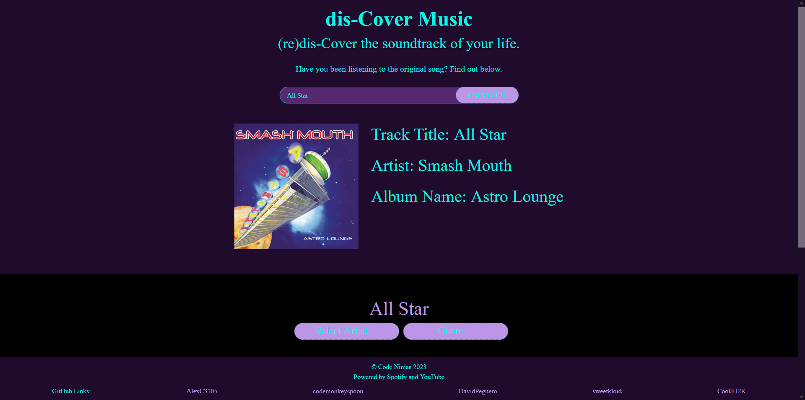

# dis-Cover Music
## Description
GIVEN A user wants to find cover songs of their favorite songs

WHEN the user visits the application they are greeted with a call to action to enter

THEN uppon entering they are greeted with a search bar to search a track

THEN the user can further filter their search by using the dropdown artist selection

THEN upon selecting the prefferred track they are then shown youtube covers of their selected song

THEN they can change the genre from the genre selection

THEN they can restart the process by clicking a button that returns them to the landing page
## Usage and Screenshots
Github linked here: [Github](https://github.com/CoolJH2K/dis-cover-music)

Webpage linked here: [Webpage](https://cooljh2k.github.io/dis-cover-music/)

## Installation
N/A
## Credits
The people who worked on the application:
* https://github.com/CoolJH2K
* https://github.com/DavidPeguero
* https://github.com/sweetkloid
* https://github.com/codemonkeyspoon
* https://github.com/AlexC3105
## License
This application uses the MIT License